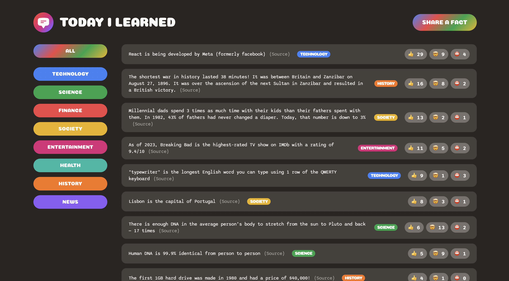

# Portfolio Project: Personal Web Application for Article Management

As a front-end developer preparing for a career in the industry, I have built a web application utilizing HTML, CSS, JavaScript, React, and Supabase. This application allows users to add URLs, categories, and texts of articles they have read throughout the day, providing a streamlined way to manage and track their learning progress.

You can view the live project [here](https://todayilearned-mj.netlify.app/).

## Key Features

- **Article Management**: Easily add, categorize, and save article URLs with accompanying texts.
- **User Authentication**: Secure login and registration using Supabase for backend services.
- **Responsive Design**: Ensures a seamless experience across various devices and screen sizes.
- **Real-time Updates**: Instantly reflects changes using React’s state management.

## Technologies Used

- **HTML & CSS**: For structuring and styling the application.
- **JavaScript & React**: For building dynamic, interactive user interfaces.
- **Supabase**: For backend services, including database management and user authentication.

## Project Goals

- Enhance my proficiency in modern web development technologies.
- Demonstrate my ability to build functional, user-friendly web applications.
- Showcase my skills in front-end development to potential employers.
